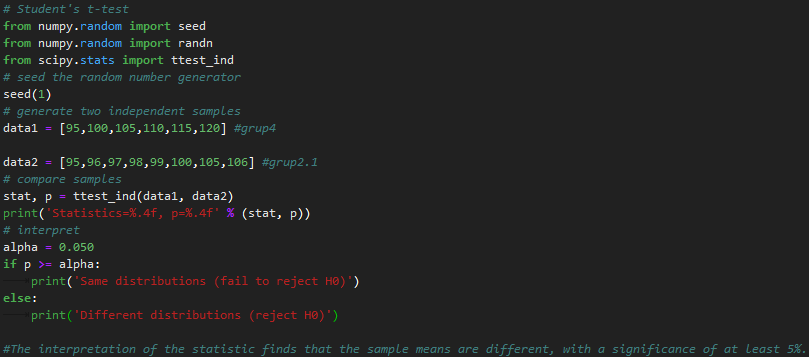
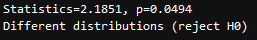

# T-Test
Essentially, a t-test allows us to compare the average values of the two data sets and determine if they came from the same population.

# What is t-score?

The t score is a ratio between the difference between two groups and the difference within the groups. The larger the t score, the more similarity there is between groups. The smaller the t score, the more difference there is between groups. 

    A large t-score tells you that the groups are similar.
    A small t-score tells you that the groups are different.
 
# Example of T-Test
    Compare 2 different population...

# Output

